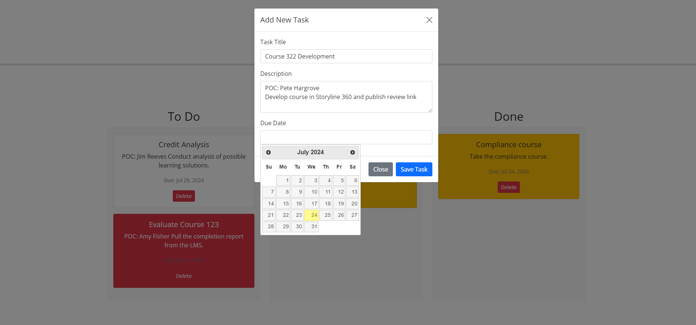
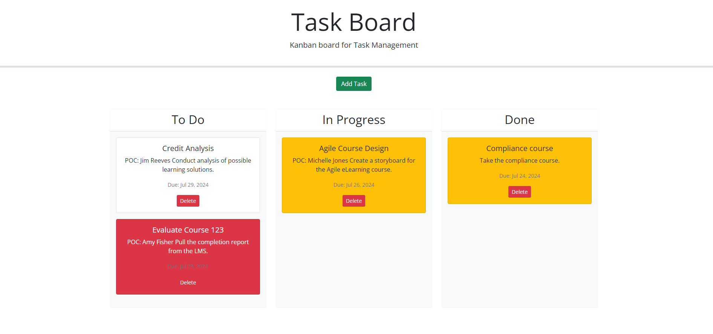

# module-five-challenge

## Description
I created a project management application. I may able to keep track of due dates and progress. I utilized jQuery UI to make the application more interactive and user-friendly.
-   Designed a Kanban board with 3 swim lanes and task cards.
-   Created a form to input new tasks.
-   Implemented the Dayjs Jquery to add the calendar.
-   Added drag and drop feature, colors, and delete functionality.

Also, I learned how to implement jQuery into my JavaScript.

CODE SOURCE NOTE: I worked with a tutor on this assignment.

## Deployed Website Link
https://agrove21.github.io/module-five-challenge/

## Screenshot

